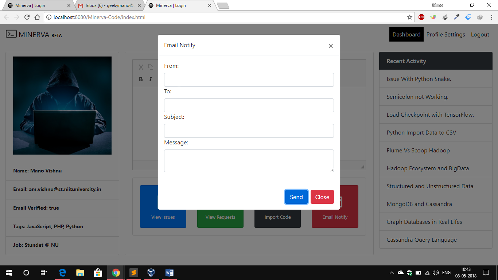
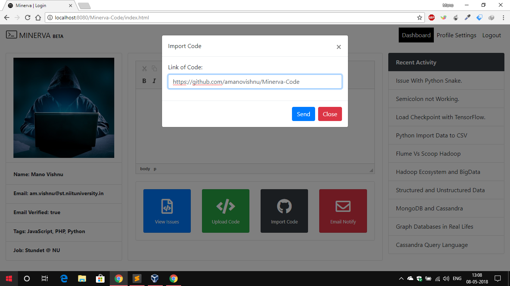

# Minerva-Code-Analysis-Tool

### What is Static Analysis ?
Static analysis, also called ***static code analysis***, is a method of computer program debugging that is done by examining the code without executing the program. The process provides an understanding of the code structure, and can help to ensure that the code adheres to industry standards. Automated tools can assist programmers and developers in carrying out static analysis. The process of scrutinizing code by visual inspection alone (by looking at a printout, for example), without the assistance of automated tools, is sometimes called program understanding or program comprehension.

### What is a Static Analysis Tool ?
Static analysis tools are generally used by developers as part of the development and component testing process. The key aspect is that the code (or other artefact) is not executed or run but the tool itself is executed, and the source code we are interested in is the input data to the tool

# Sample-Images

<b>Homepage-of-Minerva</b>

<b>Sign-In-Page</b>

<b>Sign-Up-Page</b>

<b>Dashboard-of-Minerva</b>

<b>Email-Notification-Feature</b>

<b>Import-Code-Feature</b>

<b>Upload-Code-Feature</b>

<b>Profile-Setting-Page</b>

<b>Logout-Page</b>

<b>© Created by Manovishnu</b>

